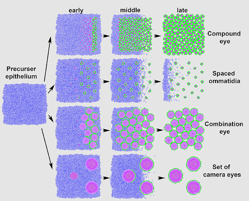

# Eye Development Model

## Introduction:
Eye Development Model (EDM) is a python application used to model and simulate the growth and development of eyes given
different parameters.  The model is based mainly on what is known about the development of D. melanogaster eyes.  The 
user can even observe in 2D what causes differentiation between different eye types by changing individual parameters of
the cells.  The application is designed to also allow the user to define their own events to occur to on the epithelium 
of the eye.

  

  

## Team Members:
### Nick Moseley:
__Contact:__  
moselenw@mail.uc.edu  
moselenw1@gmail.com

__Skills:__  
- Research Background  
- Data Science  
- Backend Development (python, c++)

__Interests:__  
- Simulation Design and Implementation

### Ryan Lavin:
__Contact:__  
lavinrp@mail.uc.edu  
lavinrp@gmail.com

__Skills:__  
- Object Oriented and Data Oriented Design  
- Parallel Computing  
- Gpgpu

__Interests:__  
- NeuroBio
- Requirements Engineering
- Software Engineering
- Parallel Computing

### Brian Bauer:
__Contact:__  
bauerbp@mail.uc.edu  
baubaubrian@gmail.com

__Skills:__  
- C++  
- OO programming

__Interests:__  
- Network Analysis  
- Biology

### Joe Disalvo:
__Contact:__  
DiSalvoJoe@gmail.com  

__Skills:__  
- Functional Programming
- DSL design
- Backend Development
- Eliciting Requirements

__Interests:__  
- Programming Language Design
- Parallel Computing

## Project Background Description
The underlying biological processes and patterns of early eye development are known for fruit flies and a few other species; however, a comprehensive model for all species has not been built. This project aims to use known rules to predict the development of any species� eyes by applying said rules to variable biological constraints. The simulated structure can then be compared to real samples to determine if this model can be used to correctly predict eye development in other species.

## Problem Statement
Simulating the development of eyes by projecting known growth models onto variable biological constraints.

## Inadequacy of Current Solutions
Existing simulations either do not adequately simulate the macro level growth of the eye, or do not adequately use what is known about current models to predict the growth of different eye types.  

## Project Goals and Approach
We plan to work directly with the neurobiology department based on an incremental delivery plan. This will allow us to quality check the rules governing the simulation and to revise as needed. To start, our group will research popular technologies based on the initial requirements of the customer. These include specification requirements such as developing a Python based simulation. Our first goal is to develop a 2-D solution. We plan to separate the behavioral simulation and the visual presentation of the project to allow for a seamless transition into a 3-D model. The final phase will be to revise and fine-tune the 3-D model based on customer review. This will mark the end of our senior design project.
