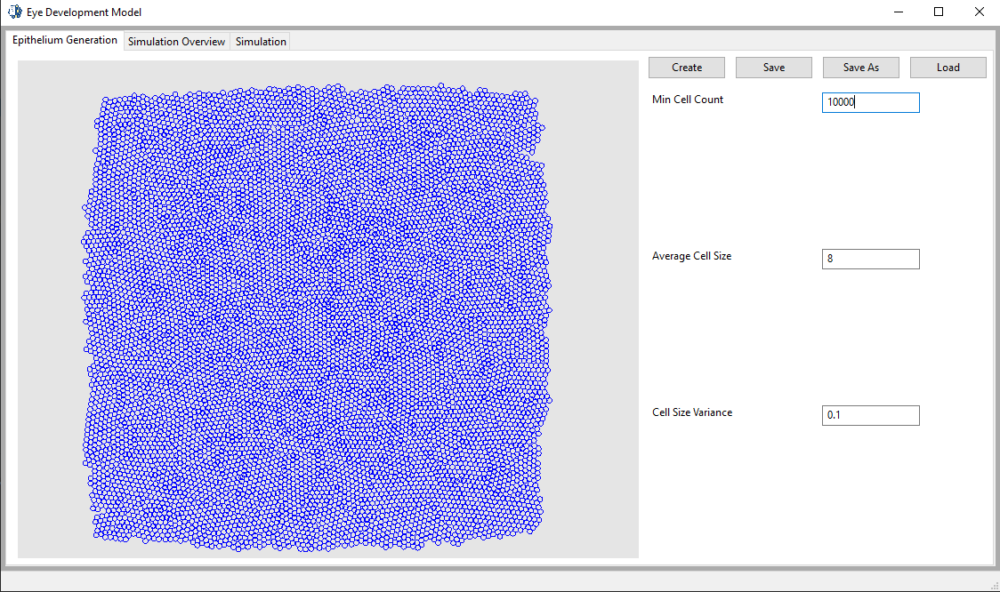

# Eye Development Model - User Guide
## Installation
1. [Download](https://www.python.org/downloads/) Python version 3.4 or greater
  * We recommend using a [virtual environment](https://docs.python.org/3/tutorial/venv.html). This is [easy](https://www.jetbrains.com/help/pycharm-edu/creating-virtual-environment.html) to do with IDEs like [pycharm](https://www.jetbrains.com/pycharm/)

2. Install required packages with [pip](https://docs.python.org/3/installing/). This is [easy](https://www.jetbrains.com/help/pycharm/installing-uninstalling-and-upgrading-packages.html) to do with IDEs like pycharm.
  * pyopengl - version 3.1.0 or greater
  * moderngl - version 5 or greater
  * numpy - version 1.13.3 or greater
  * pyrr - version 0.9.2 or greater
  * wxPython - version 4.0.1 or greater

3. [Clone](https://help.github.com/articles/cloning-a-repository/) or download the latest version of [Eye Development Model](https://github.com/lavinrp/EyeDevelopmentModel)
  * Most people should stay on the stable [master](https://github.com/lavinrp/EyeDevelopmentModel/tree/master) branch
  * Some brave souls may wish to use the unstable [develop](https://github.com/lavinrp/EyeDevelopmentModel/tree/develop) branch
___
## Troubleshooting
If you are having trouble rendering, try setting some of these settings.  Eye Development Model currently only supports altering settings via environment variables.

The settings available are:
  * disable OpenGL core profile -> eye_develop_model_no_ogl_core
    * Forces Eye Development Model to use OpenGL in compatibility mode. Linux and Mac users should try setting this variable if they get a driver error that prevents epithelium rendering
    * On by default for Windows users
  * enable OpenGL core profile -> eye_develop_model_ogl_core
    * Forces Eye Development Model to Use OpenGL's Core Profile. Windows users should try settings this variable if they get a driver error that prevents epithelium rendering.
    * On by default for Linux and Mac users
  * Use legacy OpenGL display -> eye_develop_model_legacy_display
    * This forces Eye Development Model to use OpenGL imediate mode to do all of its rendering. This mode is **very** slow and minimally supported. It is advised that users only use this mode if they cannot render an epithelium using either of the two settings above
___
## General Use
### Epithelium Generation
An Epithelium can be generated or loaded from the _Epithelium Generation_ tab in the top left. After an epithelium is generated it can be saved to be loaded later or sent to someone else to load.

  

### Simulation Overview
The _simulation Overview_ tab will let you start, stop, and pause a simulation as well as change any of the simulation's parameters, or any of the parameters used for cell specialization.

  

### Simulation
The _Simulation_ tab will only let you start, pause, and stop the simulation, but it provides a better view.

  

>Note that simulation and specialization options cannot be changed after a simulation has started.

___
## Changing the Code
Some users may want to change the way that simulations behave or the way that the epithelium is displayed in ways that cannot adequately be achieved through changing settings in the GUI. The **quick_change** module contains all the tools that most users should need to achieve their desired simulation.
### Custom Furrow Events
As the furrow moves across the epithelium *furrow events* are applied to all of the cells in its wake.

Users can add a furrow event by creating an instance of the FurrowEvent class, creating a function for that furrow event to execute as it moves across the epithelium, and adding the furrow event to the list of furrow events found at the bottom of quick_change/FurrowEventList.

In order for a function to be used by an instance of the FurrowEvent class it must take 3 inputs: field_types, epithelium, and cells.
  1. __field_types:__ a dictionary with a string key and a FieldType value. This dict allows you to access all user inputs that show up on the gui for this furrow event. The key of the dict must exactly match the label of the gui input (adding inputs to the gui is described below).
  2. __epithelium:__ An instance of the Epithelium class.  The epithelium that the furrow is acting on.
  3. __cells:__ A list containing instances of the Cell class. The cells that the furrow is currently acting on.

Any return value from the function will be ignored. The function must provide its own exception handling.

After a function had been declared an instance of the FurrowEvent class can be created. This furrow event will invoke the function you created above at the correct time and provide all of its inputs.

The FurrowEvent is created with a name, a distance from the furrow, a dictionary of field types, and a run function.

  1. __name:__ the name (type string) of the furrow event.
  2. __distance_from_furrow:__: The furrow event will operate on cells this far away from the furrow.
  3. __field_types:__: a dictionary with a string key and a FieldType value. This is where you declare the field types that will be passed into your function. Every field type that you access in your function must be in the dict that you pass to this input. The key value will be the label for the gui input.
  4. __run:__ the function that you declared above.

The final step to adding a new furrow event is appending your new event into the furrow_event_list at the bottom of quick_change/FurrowEventList.py. Furrow events that are not in this list will not be used in the simulation.

### Custom Cell Events

Cell events are a function or a callable class that takes a single parameter: the cell to operate on.

 After a cell event is added to a cell with
 > def event (cell): pass

> cell.cell_events.append(event)

 The cell event will be run on the cell every tick of the simulation. Each cell can have its own unique set of cell events.
### Custom Rendering

You can change the rules governing the appearance of cells from the quick_change/CellDisplayRules.py file.
